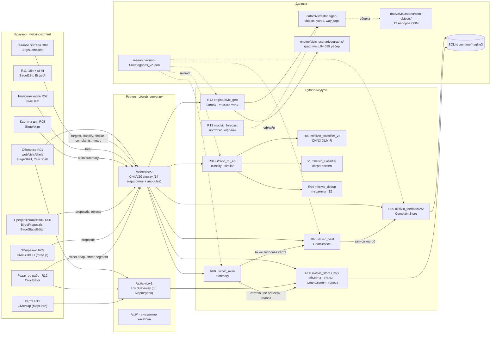
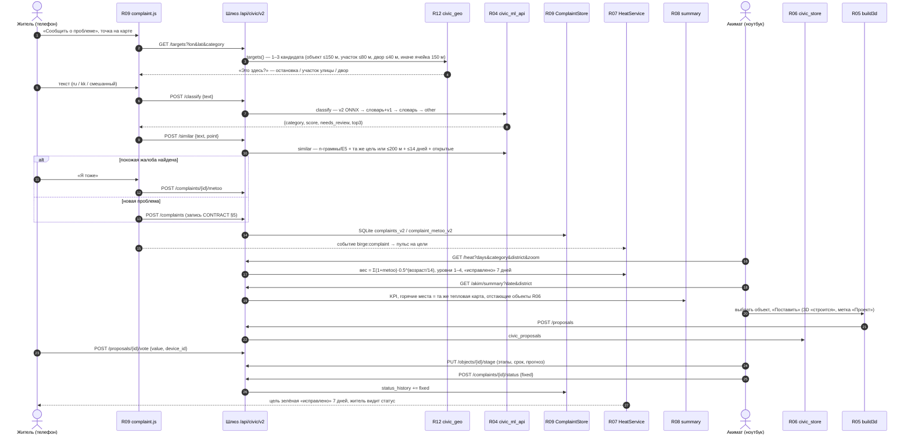
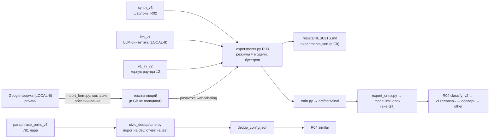

# Birge · архитектура

> Документ R14 (раунд 14) по **фактическому коду веток ролей** на 10 октября 2026 (не по планам).
> Ветки и SHA каждого модуля — в `MODULES.md`; цифры с источниками — `research/round-14-results/R14/FACTS.md`.
> Контракт форматов и API — `research/round-14/CONTRACT.md` (при расхождении документа и контракта прав контракт, при расхождении контракта и кода — смотрите код и `MODULES.md`, раздел «Расхождения»).

## 0. Коротко

- **Birge** — платформа обратной связи жителей и акимата Астаны: жалоба → категория и похожие → тепловая карта объектов → «Картина дня» → предложение с 3D-превью и голосованием → этапы и статус «исправлено».
- **Один процесс Python** (`app.py` → `ui/web_server.py`, только стандартная библиотека, `ThreadingHTTPServer`) отдаёт статику и три API: старое `/api/*` (хакатонный симулятор), `/api/civic/v1/*` (модули раундов 11–13), `/api/civic/v2/*` (модули раунда 14, CONTRACT §7).
- **Браузер**: одна страница `web/index.html`, карта MapLibre GL JS 5.6.2, модули подключаются `<script defer>` и экспортируют глобальный объект с `mount(...)`. Без React, без npm-сборки.
- **Данные**: SQLite в `.runtime/` (жалобы, объекты, этапы, предложения, голоса, сессии сотрудников), неизменяемые файлы OSM и графа улиц в `data/` и `engine/civic_scenarios/graphs/`, словари ru/kk в `web/civic/i18n/`.
- **ML**: обучение — офлайн на ноутбуке (GPU), в приложение попадает только ONNX-файл; в рантайме классификатор и поиск дублей работают на CPU и имеют запасные пути без нейросети.
- **Принцип**: считает код, а не языковая модель; синтетика всегда помечена `demo: true` / «Пример»; линии на карте только по настоящей форме улиц OSM.

## 1. Два слоя в одном репозитории

| Слой | Что это | Где | Статус в раунде 14 |
|---|---|---|---|
| **«Аким на 5 часов»** (хакатон, сентябрь 2026) | Учебный симулятор: выбор 5 мер из 14 при бюджете 100 у.е., Astana Quality of Life Score, оптимизатор полным перебором, 8 событий, ИИ-советник | `engine/` (кроме `civic_*`), `agent/` (кроме `civic_assistant`), `data/city_data.json`, `data/events.json`, `web/app.js`, `web/interface.js`, `web/map.js` | заморожен; доступен по ссылке `#training`; описан в `README.md` и `PROJECT_CONTEXT.md` |
| **Платформа civic v1** (раунды 11–13) | Реестр объектов работ, редактор, сообщения жителей с модерацией, сравнение перекрытий A/B на графе, помощник по фактам | `ui/civic_store/`, `ui/civic_feedback/` (v1), `engine/civic_scenarios/`, `agent/civic_assistant/`, `web/civic/{map,editor,feedback,scenarios,assistant,shell}/` | работает через `/api/civic/v1`; сравнение перекрытий и помощник в шапке Birge скрыты (`?tools=all` возвращает) |
| **Birge v2** (раунд 14) | Сценарий демо CONTRACT §0 | модули ролей R02–R13 (таблица §3) | модули сданы в своих ветках; сборка R01 в процессе (B1 → B2 → FINAL 15.10) |

## 2. Схема модулей

Пунктир — чтение файла или офлайн-сборка, не HTTP. На схеме — целевое подключение (CONTRACT §7); что уже подключено в сборке R01 — §8.

## 3. Модули и их владельцы

| Роль | Модуль | Python | Браузер (глобальный объект) | API v2 (CONTRACT §7) |
|---|---|---|---|---|
| R01 | Оболочка, сервер, шлюзы | `ui/web_server.py` | `web/civic/shell/` — `BirgeShell`, `CivicShell`, `CivicExplore`, `BirgeShellText` | `GET /modules` |
| R02 | Данные и разметка | `ml/datasets/`, `ml/labeling/` | `web/labeling/` (офлайн, file://) | — |
| R03 | Классификатор v2 | `ml/civic_classifier_v2/` (`predict.Classifier`) | — | через R04 |
| R04 | Дубли и ML-API | `ml/civic_dedup/`, `ui/civic_ml_api/` | — | `POST /classify`, `POST /similar` |
| R05 | 3D-превью | — | `web/civic/build3d/` — `CivicBuild3D` (three.js 0.169.0) | использует `/proposals` R06 |
| R06 | Предложения, голоса, этапы | `ui/civic_store/` (+ `v2.py`, `proposals.py`, `stages.py`) | `web/civic/proposals/` — `BirgeProposals`, `BirgeStageEditor` | `GET/POST /proposals`, `POST /proposals/{id}/vote`, `GET /objects`, `PUT /objects/{id}/stage` |
| R07 | Тепловая карта | `ui/civic_heat/` (`HeatService`, `api.handle_get`) | `web/civic/heat/` — `CivicHeat` | `GET /heat` |
| R08 | Картина дня | `ui/civic_akim/` (`summary`) | `web/civic/akim/` — `BirgeAkim` | `GET /akim/summary` |
| R09 | Жалоба жителя v2 | `ui/civic_feedback/v2/` (`ComplaintStore`, `ComplaintsV2Service`) | `web/civic/feedback/complaint.js` — `BirgeComplaint` | `POST/GET /complaints`, `POST /complaints/{id}/metoo`, `POST /complaints/{id}/status` |
| R11 | UX и казахский | — | `web/civic/ui-kit/` — `BirgeUI`; `web/civic/i18n/` — `BirgeI18n` | — |
| R12 | Точность карты | `engine/civic_geo/` (`targets`, `segment_between`, …) | `web/civic/map/` — `CivicMap`; `web/civic/editor/` — `CivicEditor` | `GET /targets` (+ `/street-segment`, `/street-snap`, `/objects-near`, `/yard`, `/geo/status`) |
| R13 | Прогноз (прототип) | `ml/civic_forecast/` | — | план: `GET /forecast` (кода маршрута нет) |

Подробно по каждому модулю (файлы, функции, тесты, ограничения) — `MODULES.md`.

## 4. Поток данных: жалоба → модель → тепловая карта → картина дня → решение → статус

Шаги подробно:

1. **Место.** `complaint.js` (R09) берёт точку с карты или геолокации и вызывает `/targets` (R12). Кандидаты — реальные объекты OSM (`osm-node-…`, `osm-way-…`), участок улицы — ребро пешеходного графа (`osm-w<way>-<n>`) с настоящей формой, двор (`yard-…`) или ячейка ~150 м (`cell-…`, пометка «Примерное место»). Если цели нет — R09 сам ставит ячейку 150 м.
2. **Текст и категория.** `/classify` (R04): цепочка «модель v2 R03 (ONNX) → словарь R03 + логрегрессия v1 → словарь → `other`». Пока модель не проверена на текстах людей, `needs_review = true` всегда. Житель видит подсказку категории чипом и может выбрать сам (`category_source: resident|model|staff`).
3. **Дубли.** `/similar` (R04) ищет открытые жалобы рядом (та же цель или ≤ 200 м, ≤ 14 дней). Если нашлось — шаг «Об этом уже сообщили N» и кнопка «Я тоже» (одно на устройство, новая запись не создаётся).
4. **Запись.** `/complaints` (R09) сохраняет запись CONTRACT §5 в SQLite, язык определяет сервер (ru / kk / mixed), номер для жителя `B-0001`, срок первого ответа по категории. Публичный ответ никогда не содержит текст жалобы и идентификатор устройства.
5. **Тепловая карта.** `HeatService` (R07) берёт записи R09, считает вес цели с периодом полураспада 14 дней, уровни из `categories_v2.json`, число людей на значке; при zoom < 12 — суммы по районам. Новая жалоба → событие `birge:complaint` → пульс-кольцо и плавное перетекание цвета 800 мс.
6. **Картина дня.** `summary` (R08) берёт горячие места, темы и районы **из той же тепловой карты** (поэтому числа совпадают — есть тест `test_r08_heat_match.py`), считает 4 KPI, просрочки по срокам категорий и отстающие объекты R06; текст сводки ru/kk собирает шаблон без LLM.
7. **Решение.** Акимат ставит объект из каталога R05 (сквер, площадка, спортплощадка, остановка, освещение) — он «строится» в 3D с меткой «Проект · 2027» — и сохраняет его как предложение R06. Жители голосуют «За/Против» (один голос с устройства, хранится хэш с солью). Этапы объекта `planned → design → procurement → construction → acceptance → operating`, отставание и «давно не обновлялось» (> 14 дней) считает R06.
8. **Статус.** Сотрудник переводит жалобу в `accepted → in_progress → fixed` (R09, история статусов). Тепловая карта показывает цель зелёной «исправлено» 7 дней с нулевым весом; житель видит шкалу статуса в «Мои обращения».

## 5. Сервер и шлюзы (`ui/web_server.py`)

- `http.server.ThreadingHTTPServer`, только стандартная библиотека; порт по умолчанию 8501 (`run.bat`), 8611 (`run-city.bat`); хост 127.0.0.1.
- Все ответы: `Cache-Control: no-store`, `X-Content-Type-Options: nosniff`, `Referrer-Policy: same-origin`, `X-Frame-Options: DENY`, CSP `frame-ancestors 'none'`. Host — только loopback/свой адрес, сторонний Origin → 403.
- Статика — только по белому списку `ASSETS` / `CIVIC_ASSETS` (листинга каталогов нет). **Новый файл фронтенда не будет отдан, пока его не добавили в `CIVIC_ASSETS` и `web/index.html`.**
- `/api/civic/v1` — `CivicGateway`: 30 маршрутов; сервисы создаются лениво; нет пакета → 503 `module_unavailable`; `/staff/*` — сессия сотрудника (cookie + `X-CSRF-Token`, модуль `ui/civic_store`).
- `/api/civic/v2` — `CivicV2Gateway`: таблица `V2_HANDLERS` (маршрут → роль → модуль → функция), функция ищется `importlib` при первом вызове. Шлюз проверяет вход до вызова (текст ≤ 5000 символов, точка и bbox внутри Астаны 70.9–71.9 × 50.9–51.4, категория из `categories_v2.json`, `days` 1–365, `zoom` 0–24, дата `ГГГГ-ММ-ДД`, голос ±1, `device_id` 8–128 символов) и переводит исключения в коды: `ValueError` → 400, `LookupError` → 404, `PermissionError` → 403, нет модуля/функции → 503 `module_not_ready`. `GET /api/civic/v2/modules` показывает, какие модули подключены.
- Лимиты: тело 64 КБ (civic), 128 КБ (старое API); строка запроса 2048 символов.

## 6. Хранилища

| Что | Где | Кто пишет | Кто читает |
|---|---|---|---|
| Объекты работ, этапы, предложения, голоса, сессии сотрудников | SQLite: `.runtime/civic.sqlite3` (`run.bat`) или `.runtime/round11-local.sqlite3` (`run-city.bat`); таблицы `civic_*`, миграция 6 добавляет `civic_object_stages`, `civic_stage_history`, `civic_proposals`, `civic_proposal_history`, `civic_votes`, `civic_v2_settings` | R06 `ui/civic_store` | R06, R08, R12-редактор, R05 через API |
| Жалобы v2 | та же база: `complaints_v2`, `complaint_metoo_v2`, `complaint_events_v2`, `complaint_meta_v2` | R09 `ComplaintStore` | R07, R08 (через R07), R04 `similar` |
| Сообщения жителей v1 | та же база, таблицы `ui/civic_feedback` v1 | R09 (раунд 13) | миграция v1 → v2 |
| Объекты OSM, дворы, теги улиц | `data/civic/astana/geo/*.json` (собирается из `osm-objects/`) | R12 `build_geo_data` (офлайн) | R12, R07, R13 |
| Граф улиц | `engine/civic_scenarios/graphs/osm-astana-walking-20260506.graph.json` + `MANIFEST.json` (sha256) | только чтение | R12, R07, R09 (id участков), сценарии v1 |
| Категории | `research/round-14/categories_v2.json` (сервер), копия `web/civic/ui-kit/categories_v2.json` (браузер) | владелец пакета | все |
| Переводы | `web/civic/i18n/ru.json`, `kk.json` (+ свои словари модулей до переноса ключей) | R11 | все экраны, R08 на сервере |
| Модели ML | вне Git: `ml/civic_classifier_v2/artifacts/` (ONNX), `ml/civic_dedup/artifacts/e5/`, кэш HuggingFace на ноутбуке | обучение на ноутбуке (LOCAL-4) | R04 |
| Состояние браузера | `localStorage`: `birge.lang`, `birge.mode`, `birge.device_id` (R05/R06/R07), `birge.device` (R09; в сборке B1 R01 свёл R07/R09 к одному ключу), `birge.heat.metoo`, `birge.build3d.proposals.v1`; `sessionStorage`: черновик жалобы | модули | модули |

Соль для хэшей устройств хранится только в базе (у R06 и у R09 своя). Персональные данные в Git не попадают: сырые ответы формы — в `private/` (в `.gitignore`).

## 7. Связь модулей в браузере

| Событие | Где | Кто шлёт | Кто слушает |
|---|---|---|---|
| `birge:lang` | `document` и `window` | `BirgeI18n` (R11) при смене ҚАЗ/РУС | R09, R07, оболочка |
| `birge:mode` | `document` | `BirgeShell` (Акимат/Житель) | `CivicShell` |
| `civic:mode` | `document` | `CivicShell` | `BirgeShell` |
| `birge:complaint` | `window` | R09 (`created`/`metoo`) | R07 (пульс, обновление) |
| `birge:heat-select` | от корня R07 | R07 (выбрана цель) | оболочка (план) |
| `birge:open-target` | `document`, отменяемое | R08 (клик по горячему месту) | оболочка/R07 (план); если не отменено — переход по ссылке на карту |
| `civic-editor:tool`, `civic-scenarios:tool`, `civic-build3d:tool` | `document` | редактор R12, сценарии, R05 | карта R12 (пауза клика карты), оболочка |
| `civic-r03:layout` | `document` | карта R12 | модули панелей |

Общий контракт монтирования: `window.<Модуль>.mount({root, map, api, lang, mode, ...}) → {update?, refresh?, destroy?}`. Модуль без своего экрана карты не создаёт карту, а получает объект MapLibre хоста.

## 8. Состояние интеграции на 10 октября 2026 (кандидат B1 — R01 `claude/sharp-dijkstra-0t87gl` @ d3c33d9)

- В сборке: модули раунда 13 (I0), ui-kit/i18n R11, поставки R02 (229f1aa), R07 (5a97636), R08 (9f1d9c0), R09 (da295be). **Не включены** (на момент сборки не было DELIVERY): R03, R04, R05, R06, R12, R13.
- Проверено R14 запуском (Linux, Python 3.13.16, `CIVIC_DEMO=1`): `civic-v2: ready R07, R08, R09`; маршруты жалоб (11), тепловой карты (`/heat`, `/heat/meta`, `/heat/target`) и `/akim/summary` — `ready`; `/classify`, `/similar`, `/targets`, `/proposals*`, `/objects*` — 503 `module_not_ready`; файлы `akim.js`, `heat.js`, `complaint.js` отдаются (200); `/heat` — 43 цели за 14 мс; жалоба создаётся и видна в «Моих обращениях» (без `/targets` — с пометкой «Примерное место»).
- Браузерный путь демо B1 у R01 (`r14_b1.cjs`): 15/0 — жалоба `B-0001`, +1 на карте, «Мои обращения», «Картина дня», горячее место → цель на карте, «Взять в работу» → «Исправлено» (зелёная). Весь pytest — 1 793 passed / 11 skipped.
- Что R01 уже решил в сборке (адаптеры и минимальные правки, переданы владельцам): подключение R07/R08 через `handle_get` и R09 через его 11 маршрутов; общий ключ устройства R07/R09; событие `birge:lang` на `window` и `document`; cookie сотрудника для `/api/civic/v2` (`COOKIE_PATH = "/api/civic"`); адаптер сетки ячеек «примерного места» (сетки R07 и R09 разные — место жителя смещалось на ~7 км); сброс кэша тепловой карты по событиям R09.
- Остаётся (по INTEGRATION ролей, BUGS R10 и чтению R14):
  1. Подключить R04 (`/classify`, `/similar` + patch `r01_similar_target.patch`), R12 (`/targets` и 5 геомаршрутов), R06 (`bind(service)` и маршруты предложений/этапов), R05 (`proposed_r01.patch`), R13 (`r01_forecast_route.patch`), ONNX-модель R03 после LOCAL-4.
  2. R05 → R06: лишние поля в `POST /proposals` (R06 отвечает 422), `DELETE` вместо `POST …/withdraw`, другой формат ответа (`{item}`).
  3. R04 + R09: `needs_review` всегда `true`, поэтому категорию никогда не выбирает модель — житель видит только подсказку (`suggest`); решение — у R01 (R10 B-003).
  4. Два справочника сроков: R09 `RESPONSE_DAYS` (первый ответ) и R08 `DEADLINE_DAYS` (исправление) — оба демо-нормативы.
  5. Сетки ячеек R07 и R09 разные — в сборке работает адаптер; роли должны договориться об одной.
  6. `categories_v2.json` в двух копиях (сервер и ui-kit) — при изменении категорий обновлять обе.
  7. Данные: R05 `astana-existing.json` содержит 41 ж/д платформу как «остановки» и 55 точек / 22 двора за границей города (R10 B-007, B-008); двор `yard-619707707` R12 частично за границей (проверяется только центр, B-009); CONTRACT §4 не называет `osm-relation-` (B-010).
  8. Гонка `civic-r03-demo-ring` в модуле карты (1 FAIL в P0, есть и на I0) — у R12.
- План: B1 вечером 13.10 (= d3c33d9 + сданные к тому времени R06/R12/R04/R05/R03), приёмка R10; B2 14.10; FINAL 15.10 18:00. Актуальный SHA — `research/handoffs/astana/R01/round14/STATUS.md`.

## 9. ML-контур

- Обучение трансформера — только на ноутбуке владельца (RTX 4060 8 ГБ, venv `C:\Users\LEGION\venvs\birge-ml`), команды — `research/round-14-results/R03/RUN.txt`.
- Оценка — на отложенном наборе текстов людей (≥ 200), синтетический test — справочно. Режимы и метрики — `docs/diploma/04_eksperimenty.md`.
- Прогноз R13 — отдельный офлайн-прототип (`ml/civic_forecast/`): территории из данных R12, синтетическая история, погода Open-Meteo (когда появится файл LOCAL-9).

## 10. Сквозные принципы (почему так)

1. **Контракт до кода.** Форматы записи, целей, весов и API зафиксированы в `CONTRACT.md` до начала работы ролей; роли работали параллельно на фикстурах этого формата.
2. **Один писатель на путь.** Каждая роль меняет только свои пути; правка чужого модуля — patch в `INTEGRATION.txt`, применяет интегратор.
3. **Считает код.** Числа на экране (вес, уровни, KPI, Score) выдаёт детерминированный Python; LLM не используется в рантайме (сводка R08 — шаблон; помощник v1 — `provider=None`).
4. **Честность данных.** Синтетика — `demo: true` и метка «Пример»/«Үлгі» в интерфейсе; реальные объекты OSM — `real`; `NOT_RUN` пишется с причиной.
5. **Точность карты.** Участок улицы — только рёбра графа OSM; остановка ≤ 60 м от улицы; нет точного места — область «Примерное место».
6. **Два языка на равных.** Весь видимый текст — через ключи `ru.json`/`kk.json`; казахский проверяет владелец, а не машинный перевод.
7. **Работает офлайн.** Всё, кроме подложки карты OpenFreeMap, работает без интернета; при её недоступности — упрощённый фон с сообщением.
